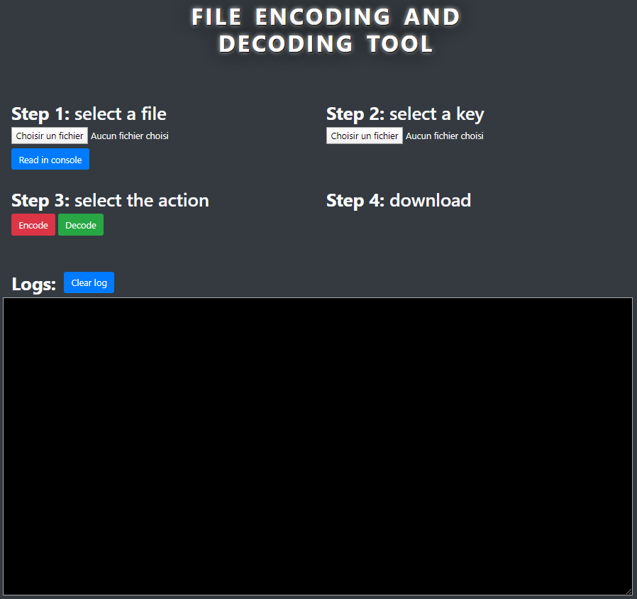
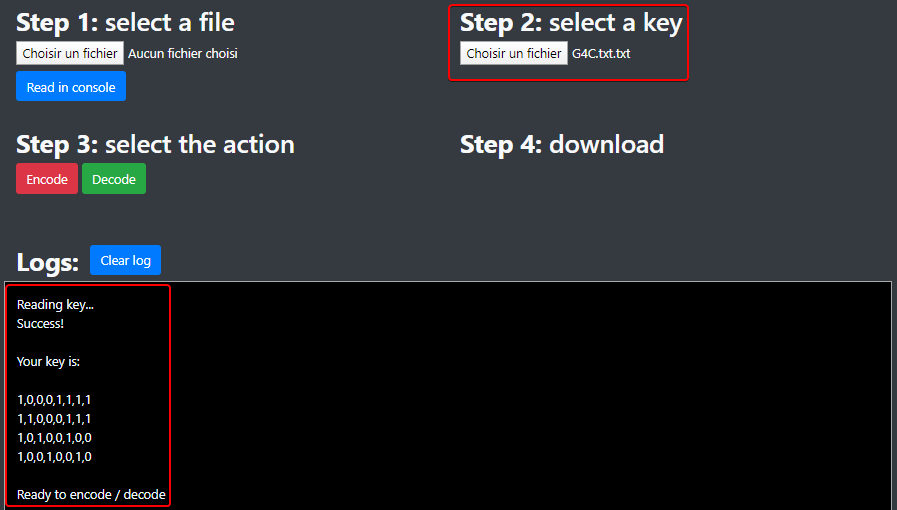
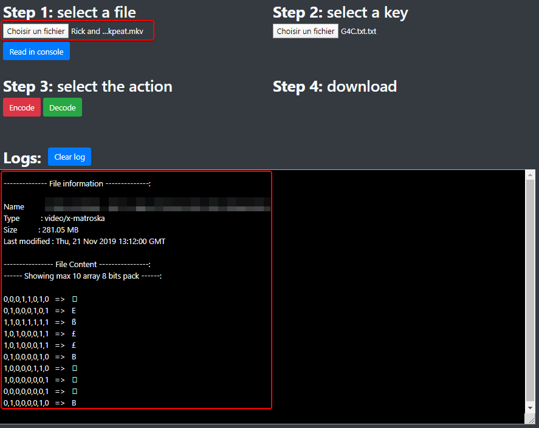
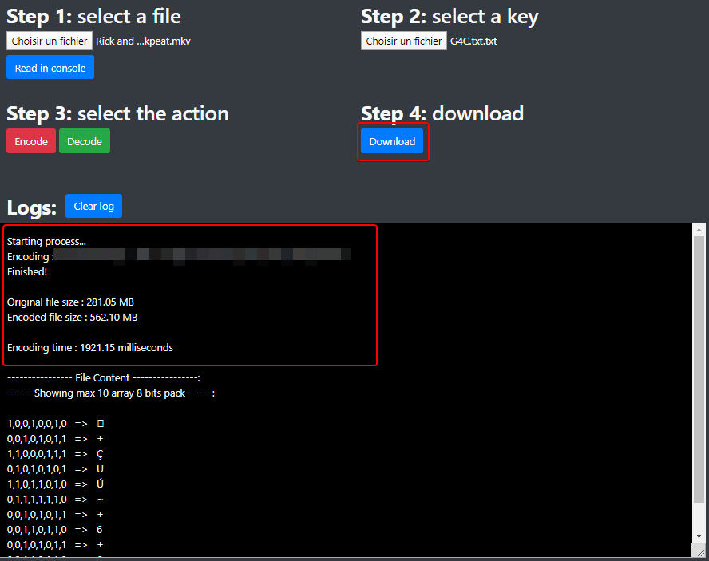
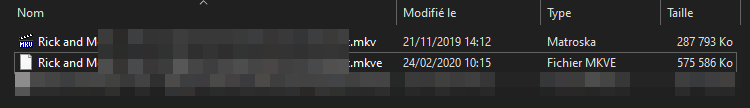
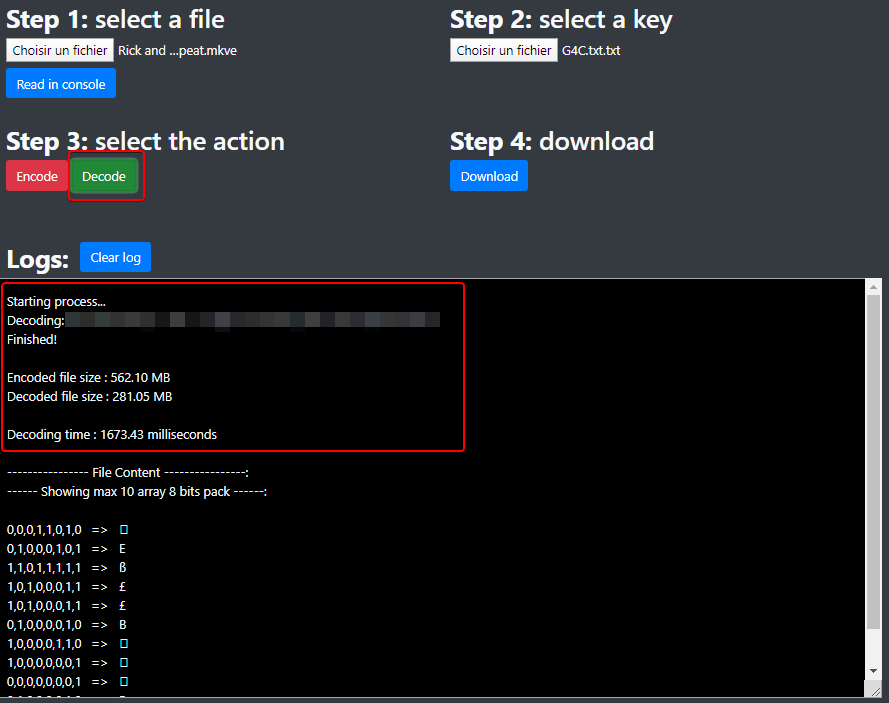
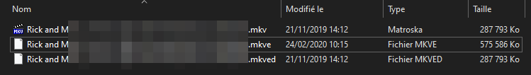

# CODEC

|  |  |
|:-----------------------------------------------------------------------:|:--------------------------------------------------------:|

## Table of contents

- [Description](#description)
  - [Features](#features)
  - [How it works: the theory](#how-it-works-the-theory)
    - [Encoding](#encoding)
    - [Decoding](#decoding)
- [Usage](#usage)
  - [Load the G4C Matrix](#load-the-g4c-matrix)
  - [Load the file](#load-the-file)
  - [Start the encoding process](#start-the-encoding-process)
  - [Start the decode process](#start-the-decoding-process)
- [Code: how the program works](#code-how-the-program-works)
  - [Loading the key](#loading-the-key)
  - [Fill the encoding matrix table](#fill-the-encoding-matrix-table)
  - [Fill the decoding matrix table](#fill-the-decoding-matrix-table)
  - [File encoding process](#file-encoding-process)
  - [File decoding process](#file-decoding-process)
- [Authors](#authors)


## Description

This application is G4C Matrix encryption program developed in JavaScript.

### Features

| Feature     | Description                           |
|:------------|:--------------------------------------|
| Encode file | Encode a file with a given G4C Matrix |
| Decode file | Encode a file with a given G4C Matrix |

### How it works: the theory

We will use a G4C encoding matrix (matrix of 4 lines, each containing the value of
one byte expressed with 8 bits) which we will load from a text file in this format:

`G4C=[10001111 11000111 10100100 10010010]`


#### Encoding

We will process the file we want to encode byte per byte by making a
matrix product with our encoding matrix:

- Our matrix: `G4C=[10001111 11000111 10100100 10010010]`
- Our byte: `1010 0101`

First, as we have a 4-line encoding matrix, we separate our byte in two 4-bit parts: `1010` and `0101`.
Then, we make a matrix product: in the program, it is actually a **XOR** between the byte and the matrix.

| Byte / Matrix |               | 1000 1111<br>1100 0111<br>1010 0100<br>1001 0010 |
|:-------------:|:-------------:|:-------------------------------------------------|
|     1010      | :arrow_right: | 0010 1011                                        |
|     0101      | :arrow_right: | 0101 0101                                        |

Result: `10100101` is coded as `00101011 01010101`  
As we see, one input byte generates an output of two encoded bytes: this means that
our encoded output file will be twice bigger than the input source file.

#### Decoding

Since coding a byte leads to getting two encoded byte, the consequence is that we
will need to process the file we want to decode 2 byte per 2 byte in order to
get one decoded byte.

The first step is to find the identity matrix in our G4C matrix columns:

|                                    1234 5678                                     | :arrow_right: |                     5234                     |
|:--------------------------------------------------------------------------------:|:-------------:|:--------------------------------------------:|
| 1**000** **1**111<br>1**100** **0**111<br>1**010** **0**100<br>1**001** **0**010 | :arrow_right: | **1**000<br>0**1**00<br>00**1**0<br>000**1** |

Once we've identified the identity columns, we save their positions: here, it's **(5-2-3-4)**.  
Back to our previously encoded byte that generated these two bytes: `00101011 01010101`.
For each of these two encoded bytes, we will select the bits located at the 5th, 2nd, 3rd and 4th position,
and then concatenate them to get back to a 8-bits decoded byte.

|   1234 5678   | :arrow_right: |   5234   |
|:-------------:|:-------------:|:--------:|
| 0**010 1**011 | :arrow_right: | **1010** |
| 0**101 0**101 | :arrow_right: | **0101** |

And voilà!  
We've just decoded these two bytes and recovered our original one: `1010 0101`


## Usage

The program GUI is pretty simple to understand:



### Load the G4C Matrix

First of all, you need to load your G4C matrix text file.  
:warning: Your key must be in this format: `G4C=[10001111 11000111
10100100 10010010]`, otherwise it won't work.



### Load the file

Then, choose the file you want to encode or decode:




### Start the encoding process

Press the **Encode** button (no kidding! :upside_down_face:) and
wait...



Once your file is encoded, a **Download** button appears to let you choose
the location of your encoded file: the letter **e** (for "encoded")
is added at the end of the file extension.



### Start the decoding process

Press the **Decode** button (haha again, no kidding! :upside_down_face:)
and wait (again too!)...



Once your file is decoded, a **Download** button appears to let you choose
the location of your decoded file: the letter **d** (for "decoded")
is added at the end of the file extension.



## Code: how the program works

### Loading the key

First of all, we need to load our key otherwise the program won't start
the encoding / decoding process.  
The key must be in valid format and will be stored in a local array
`key[4][8]`.

The `function readKey()` in `script.js` opens the
key text file and first checks the valid format of the key:

```javascript
function readKey() {
    
    ...
    
    key = "";
    keyReader.readAsText(file);

    keyReader.onload = function () {
        let result = keyReader.result;

        let i = result.search("\\[") + 1;
        result = result.slice(i, i + 8 * 4 + 3).split(' ');

        if (result.length !== 4) {
            alert("Invalid key!");
            log("Invalid key");
            return;
        } else {
            for (i = 0; i < result.length; i++) {
                if (result[i].length !== 8) {
                    alert("Invalid key!");
                    log("Invalid key");
                    return;
                }
            }
        }
```

Then, it stores the key in our `key` array:

```javascript
        for (i = 0; i < result.length; i++) {
            let string = result[i].split('');
            for (let j = 0; j < string.length; j++) {
                string[j] = parseInt(string[j], 10);
            }
            result[i] = string;
        }

        key = result;

        ...
        
        fillMatrixEncode();
        fillMatrixDecode();

        log("\nReady to encode / decode");
}
```

### Fill the encoding matrix table

During the encoding process, we don't want to process each byte of the file with the
[encoding](#encoding) method.  
If we think about it, there are only 256 possible values for a byte (0 to 255), and each
input byte will give two encoded bytes in the output: to speed the process,
we will fill a local array `matrixEncode` with
all the possibilities.  
Then, in our encoding process, we just access the correct index of the
array which is the value of the byte!

The `function fillMatrixEncode()` in `script.js` will process the
256 * 2 bytes possibilities depending on the key:

```javascript
function fillMatrixEncode() {
    matrixEncode = [];
    let matLength = key[0].length;
    let tempBin, tempBin2, i, j, code;
    for (i = 0; i < 256; i++) {
        code = decToByte[i];
        tempBin = [];
        tempBin2 = [];
        for (j = 0; j < matLength; j++) {
            tempBin[j] = (code[0] && key[0][j]) ^ (code[1] && key[1][j]) ^ (code[2] && key[2][j]) ^ (code[3] && key[3][j]);
            tempBin2[j] = (code[4] && key[0][j]) ^ (code[5] && key[1][j]) ^ (code[6] && key[2][j]) ^ (code[7] && key[3][j]);
        }
        matrixEncode[i] = [byteToDec[tempBin.join('')], byteToDec[tempBin2.join('')]];
    }
}
```

As we see, we process with a XOR function because a matrix product
between bits is the same as XOR.

### Fill the decoding matrix table

As for the encoding process, we don't want to process each byte of the file with the
[decoding](#decoding) during the decoding process. 
If we think about it, there are only 256 * 256 possible two-byte combinations: to speed
the process, we fill a local array `matrixDecode` with all the possibilities.  
Then, during the decoding process, we just access the correct index of the first
dimension of the array, which is the value of the first byte, then
the correct index of the second dimension of the array, which is the value of
the second byte!

The `function fillMatrixDecode()` in `script.js` will process the
256 * 256 bytes possibilities depending on the key:

```javascript
function fillMatrixDecode() {

    ...
    
    let matrixI4 = [];
    for (i = 0; i < key[0].length; i++) {
        i4 = "";
        for (j = 0; j < key.length; j++) {
            i4 += key[j][i];
        }
        switch (i4) {
            case "1000":
                matrixI4[0] = i;
                break;
            case "0100":
                matrixI4[1] = i;
                break;
            case "0010":
                matrixI4[2] = i;
                break;
            case "0001":
                matrixI4[3] = i;
                break;
            default:
                break;
        }
    }
```

As explained in the [decoding](#decoding) theoretical section, the first step is to find our
identity matrix in our G4C matrix columns. Once we have it, we can
continue:

```javascript
    for (i = 0; i < 256; i++) {
        for (j = 0; j < 256; j++) {
            byte = [];
            for (k = 0; k < 4; k++) {
                byte[k] = decToByte[i][matrixI4[k]];
            }
            for (k = 0; k < 4; k++) {
                byte[k + 4] = decToByte[j][matrixI4[k]];
            }
            matrixDecode[i][j] = byteToDec[byte.join('')];
        }
    }
}
```

As we see, we fill our two dimensional array with all the
possibilities, depending on our identity matrix.

### File encoding process

For this part, we will just focus on the part where we read / write
bytes, the rest of the function is just classic file processing.   
The `function encodeOpti()` in `script.js` will create the encoded
file in memory and link it to the download button.

```javascript
function encodeOpti() {
   
    ...

    fileReader.readAsArrayBuffer(file);
    fileReader.onload = function () {
        let charCode = new Uint8Array(fileReader.result);

        fileSize = charCode.length;
        fileBinTraitmentSize = fileSize * 2;
        fileBufferTraitment = new ArrayBuffer(fileBinTraitmentSize);
        fileBinTraitment = new Uint8Array(fileBufferTraitment);

        let k = 0;

        for (let i = 0; i < fileSize; i++) {
            fileBinTraitment[k] = matrixEncode[charCode[i]][0];
            fileBinTraitment[k + 1] = matrixEncode[charCode[i]][1];
            k += 2;
        }

        ...
        
    }
}
```

### File decoding process

As for the file encoding process, we will just focus on the part where we read / write
bytes, the rest of the function is just classic file processing.  
The `function decodeOpti()` in `script.js` will create the decoded
file in memory and link it to the download button.

```javascript
function decodeOpti() {
    
    ...

    fileReader.readAsArrayBuffer(file);
    fileReader.onload = function () {
        let charCode = new Uint8Array(fileReader.result);

        fileSize = charCode.length;
        fileBinTraitmentSize = fileSize / 2;
        fileBufferTraitment = new ArrayBuffer(fileBinTraitmentSize);
        fileBinTraitment = new Uint8Array(fileBufferTraitment);

        let k = 0;
        for (let i = 0; i < fileSize; i += 2) {
            fileBinTraitment[k] = matrixDecode[charCode[i]][charCode[i + 1]];
            k++;
        }

    ...
    
}
```

## Authors

This project was carried out in a group of two people, myself included.

|                                                      |                                                             |
|:-----------------------------------------------------|:-----------------------------------------------------------:|
| [Joëlle CASTELLI](https://github.com/JoelleCastelli) |  |
| [Noé LARRIEU-LACOSTE](https://github.com/Nouuu)      |           |
